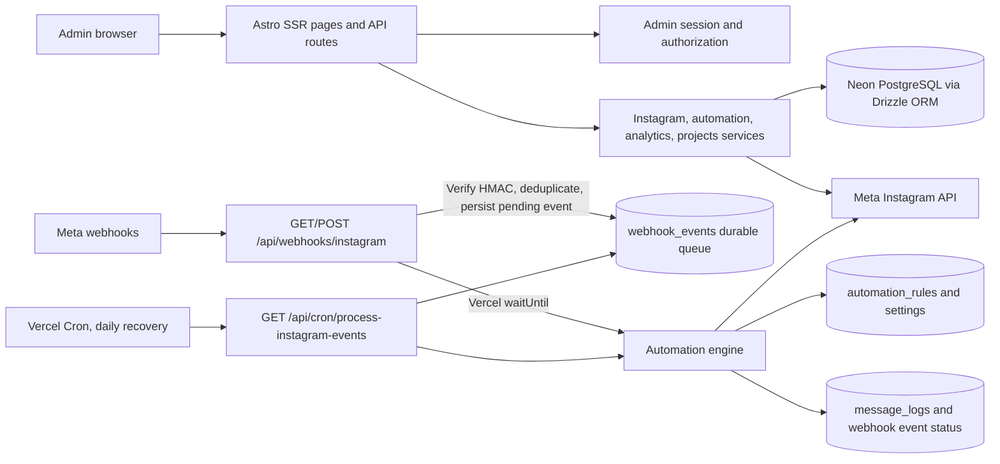

# InstaFlow

InstaFlow is an Astro server-rendered dashboard for connecting an Instagram professional account, syncing posts and Reels, managing comment-to-DM and DM reply automations, and tracking webhook delivery. It also includes a personal projects dashboard.

## Architecture



### Request and event flow

1. Astro renders dashboard pages and serves authenticated API routes. Sensitive API routes check the signed admin session in `src/lib/auth.ts`.
2. Instagram Login OAuth is handled by `/api/auth/instagram` and `/api/auth/instagram/callback`. The callback exchanges the authorization code, identifies the professional account, encrypts its token, saves it in Neon, subscribes the account to webhook fields, and syncs media.
3. `src/services/instagram.ts` calls the official `graph.instagram.com` API for account media, comments, conversations, and messages. Access tokens are decrypted server-side only.
4. Meta sends comment and messaging events to `/api/webhooks/instagram`. The route validates `X-Hub-Signature-256`, deduplicates events by ID, persists accepted events in `webhook_events`, and acknowledges Meta.
5. On Vercel, `waitUntil` claims and processes each newly queued event after the webhook response. The Hobby-compatible daily cron at `/api/cron/process-instagram-events` recovers events left pending by interrupted invocations. The engine checks global settings, active rules, media/trigger matching, and per-user cooldowns before sending a supported private reply or message. It records outcomes in `message_logs` and updates the event status.

The queue is stored in Postgres, so events can survive a serverless invocation ending. Processing is bounded and recoverable; it does not use a long-running in-memory worker. Instagram messaging remains subject to Meta permissions, eligibility, recipient interaction, and messaging-window policies. A comment-trigger rule applies to eligible webhook events received after activation; it does not retroactively automate every old comment.

### Main code areas

| Path | Responsibility |
|---|---|
| `src/pages/` | Astro pages and API routes, including OAuth, media, inbox, automation, webhook, and cron endpoints |
| `src/services/instagram.ts` | Instagram OAuth, token refresh, Graph API calls, and media/conversation synchronization |
| `src/services/automation-engine.ts` | Webhook persistence, idempotency, rule matching, delivery, retries, and execution logging |
| `src/lib/auth.ts` | Admin login checks and signed session cookies |
| `src/lib/crypto.ts` | AES-256-GCM Instagram token encryption and webhook HMAC validation |
| `src/db/schema.ts` | Drizzle schema for accounts, media, rules, events, message logs, conversations, settings, and projects |
| `drizzle/` | Ordered SQL migrations applied by `npm run db:migrate` |
| `vercel.json` | Vercel build configuration and daily webhook queue recovery schedule |
| `test/instaflow.test.ts` | Core unit/integration verification script |

## Setup guide

### Requirements

- Node.js 20 or newer
- npm
- A Neon PostgreSQL database
- A Meta developer app configured for Instagram Login and the Instagram API
- A Vercel project for production webhooks and scheduled queue processing

### 1. Install the project

```sh
git clone https://github.com/Sujoymoulick/InstaFlow.git
cd InstaFlow
npm ci
```

### 2. Configure local environment

Create `.env.local` in the project root. Start with `.env.example`, then replace each placeholder. `.env.local` is git-ignored.

```sh
cp .env.example .env.local
```

Set these values:

| Variable | Required | Purpose |
|---|---:|---|
| `DATABASE_URL` | Yes | Neon PostgreSQL connection string with TLS enabled. |
| `META_APP_ID` | Yes* | Meta app ID used by Instagram Login OAuth. |
| `META_APP_SECRET` | Yes* | Server-side Meta app secret for OAuth and webhook signatures. |
| `META_IG_APP_ID` | No | Instagram app ID override if distinct from `META_APP_ID`. |
| `META_IG_APP_SECRET` | No | Instagram app secret override if distinct from `META_APP_SECRET`. |
| `META_REDIRECT_URI` | Yes | Exact OAuth callback URL. Locally: `http://localhost:2121/api/auth/instagram/callback`. |
| `META_WEBHOOK_VERIFY_TOKEN` | Yes for webhooks | Secret string you choose and enter in Meta webhook configuration. |
| `INSTAGRAM_ENCRYPTION_KEY` | Yes | Random secret used to encrypt Instagram tokens at rest. Keep the same value for existing encrypted tokens. |
| `ADMIN_AUTH_SECRET` | Yes | At least 32 characters; signs admin sessions and is the fallback admin password. |
| `ADMIN_PASSWORD` | Recommended | Optional separate admin login password (at least 16 characters). |
| `ALLOWED_ADMIN_EMAIL` | Recommended | The only email allowed to sign in. Set this to your admin email. |
| `CRON_SECRET` | Yes for queue worker | Random secret, at least 32 characters, used to protect the Vercel cron endpoint. |
| `META_API_VERSION` | No | Graph API version; defaults to `v26.0` in this codebase. |
| `SITE_URL` | No | Canonical site URL used by Astro when `VERCEL_URL` is unavailable. |

*Set the `META_IG_*` pair or the `META_*` pair. If both are set, the Instagram-specific values take precedence for Instagram OAuth.

Generate secrets locally without putting them in source control:

```sh
openssl rand -hex 32
```

Use distinct generated values for `INSTAGRAM_ENCRYPTION_KEY`, `ADMIN_AUTH_SECRET`, and `CRON_SECRET`. Do not rotate the encryption key unless you first migrate or reconnect accounts whose access tokens were encrypted with the old key.

### 3. Prepare the database

Apply the checked-in migrations to the Neon database:

```sh
npm run db:migrate
```

The script creates a migration ledger and applies ordered SQL files from `drizzle/`. `npm run db:push` is available for local schema prototyping; use the committed migrations for deployed environments.

### 4. Configure the Meta app

In the Meta developer dashboard:

1. Enable Instagram Login for a professional (Business or Creator) account.
2. Add the exact `META_REDIRECT_URI` as an allowed OAuth redirect URI. Use the local callback for local development and the production callback for Vercel.
3. Request the permissions used by this project: `instagram_business_basic`, `instagram_business_manage_comments`, and `instagram_business_manage_messages`.
4. Configure the Instagram webhook callback as `https://<your-domain>/api/webhooks/instagram` and use the same value as `META_WEBHOOK_VERIFY_TOKEN` for verification.
5. Subscribe to the `comments`, `messages`, and `messaging_postbacks` fields. The app also subscribes the connected Instagram account to these fields during OAuth connection.
6. Ensure the Meta app has the access level, review approval, and test-user/account configuration needed for the accounts you plan to connect.

Local OAuth can be tested with `http://localhost:2121`, but Meta cannot deliver public webhooks to localhost. Use a public HTTPS development tunnel configured in Meta if you need to test inbound events locally.

### 5. Start the app

```sh
npm run dev
```

Astro listens on `http://localhost:2121`. Sign in at `/authentication/sign-in`, connect Instagram from **Instagram Connection**, sync media, then create and activate an automation for a post or Reel.

### 6. Verify before deployment

```sh
npm run check
npm test
npm run build
```

### 7. Deploy with Vercel

1. Import the GitHub repository into Vercel and set `main` as the Production Branch.
2. Add the required environment variables in Vercel for Production. Add suitable values for Preview and Development if those environments should access separate databases/accounts.
3. Set production `META_REDIRECT_URI` to `https://<your-production-domain>/api/auth/instagram/callback` and add that exact URL to Meta.
4. Confirm `vercel.json` is included in the deployment. It schedules `/api/cron/process-instagram-events` daily; Vercel supplies `Authorization: Bearer <CRON_SECRET>` to cron invocations. Newly received webhook events are processed promptly with Vercel `waitUntil`; the daily cron is only the recovery path for interrupted work.
5. Deploy and connect Instagram through the deployed site. A deployment alone does not repair a revoked Instagram token: reconnect the account if OAuth error 190 appears.

**Plan note:** Vercel Hobby allows cron jobs only once per day. The daily cron is a recovery mechanism; normal event replies run from the webhook invocation. `waitUntil` work is still subject to the configured Vercel Function maximum duration. [Vercel cron limits](https://vercel.com/docs/cron-jobs/usage-and-pricing) and [Vercel `waitUntil` documentation](https://vercel.com/docs/functions/functions-api-reference/vercel-functions-package#waituntil).

Do not put Meta secrets, admin secrets, encryption keys, or the cron secret in browser code or public `PUBLIC_*` variables. Keep `INSTAGRAM_ENCRYPTION_KEY` stable for the lifetime of encrypted account tokens.

## Pages and routes

| URL | Description |
|---|---|
| `/` | Overview dashboard |
| `/dashboard/content` | Synced posts/Reels, comments, and comment-to-DM configuration |
| `/dashboard/inbox` | Instagram conversations and message history |
| `/automations` | Automation rules and delivery controls |
| `/automations/welcome` | Welcome-message configuration |
| `/activity` | Webhook and message execution activity |
| `/analytics` | Automation analytics |
| `/settings/instagram` | Connect, reconnect, or disconnect Instagram |
| `/api/webhooks/instagram` | Public Meta webhook verification (`GET`) and event ingestion (`POST`) |
| `/api/cron/process-instagram-events` | Authenticated Vercel cron worker |

All management API routes require the admin session. The Meta webhook verification and event endpoints must remain publicly reachable; the event POST is authenticated by Meta's request signature rather than the admin cookie.

## Database tables

| Table | Stored data |
|---|---|
| `instagram_accounts` | Connected professional account metadata, encrypted token, expiration, and connection state |
| `instagram_media` | Synced post/Reel IDs, captions, media URLs, permalink, counts, and timestamps |
| `automation_rules` | Trigger type, selected media, keyword matching, response templates, and enabled state |
| `webhook_events` | Unique event IDs, raw payload, queue status, retry count, and processing errors |
| `message_logs` | Incoming text, matched rule, sent private/public replies, result, and timestamp |
| `conversations` | Cached Instagram conversation and participant metadata |
| `automation_settings` | Global automation switch, user cooldown, fallback, and welcome-message settings |
| `projects` | Project tracker data |

## Troubleshooting

- **Instagram OAuth error 190 / invalid token:** Reconnect the Instagram account in `/settings/instagram`. Ensure the OAuth callback and permissions match the Meta app configuration. The token is encrypted in Neon and cannot be reconstructed if Meta revokes it.
- **No comments:** The Comments dialog compares the cached Meta comment count with the comments returned by the official API. If the count is positive but no details are returned, confirm `instagram_business_manage_comments` access in Meta App Review, that the post/Reel belongs to the connected professional account, and reconnect after changing permissions. The API does not provide old comment details to the app in that state.
- **Automation did not reply:** Confirm the global automation switch and rule are enabled, the incoming event matches the selected media and trigger, the webhook POST signature is valid, and the event status/error in `/activity` or `webhook_events`/`message_logs`. Newly queued events are processed after the webhook response; the cron is only for recovery.
- **Webhook events remain pending:** Confirm the Vercel cron exists and `CRON_SECRET` is set in Production. Verify the cron endpoint is not blocked and inspect Vercel function logs.
- **Admin cannot sign in:** Confirm `ALLOWED_ADMIN_EMAIL` and `ADMIN_PASSWORD` (or `ADMIN_AUTH_SECRET`) are set. `ADMIN_AUTH_SECRET` must be at least 32 characters.
- **Database unavailable:** Confirm `DATABASE_URL` points to the intended Neon branch, includes TLS, and migrations have been applied.

## License

MIT. The dashboard started from the [Flowbite Astro Admin Dashboard](https://github.com/themesberg/flowbite-astro-admin-dashboard) template.
